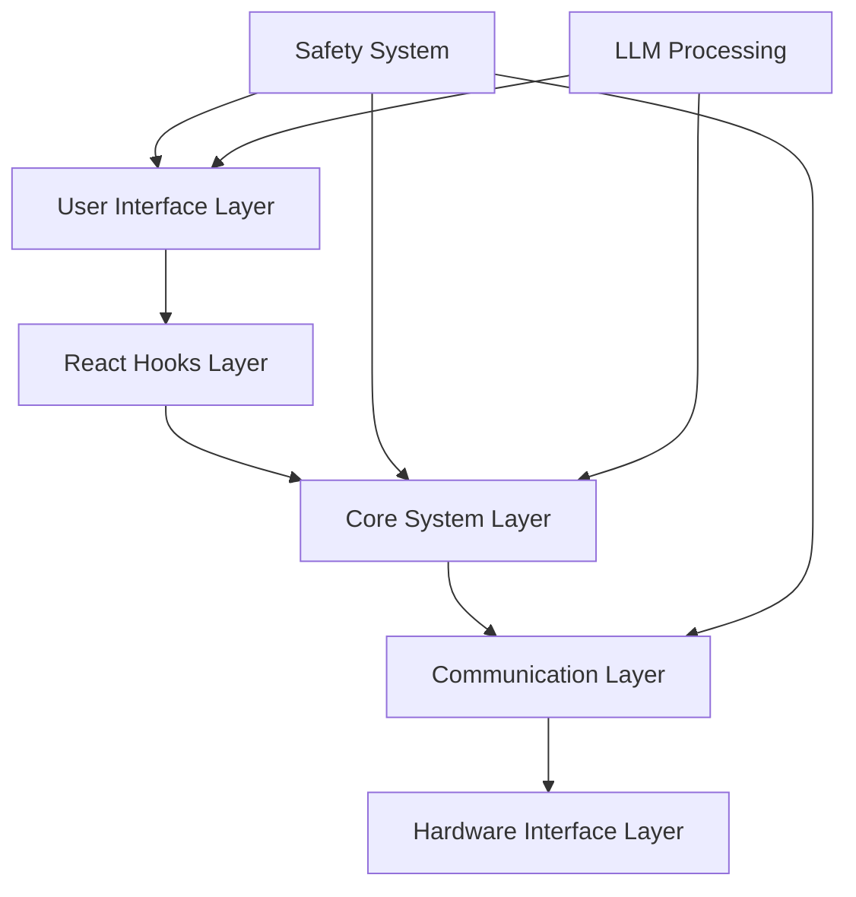
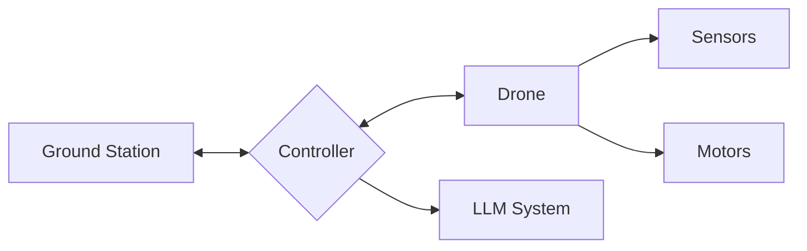
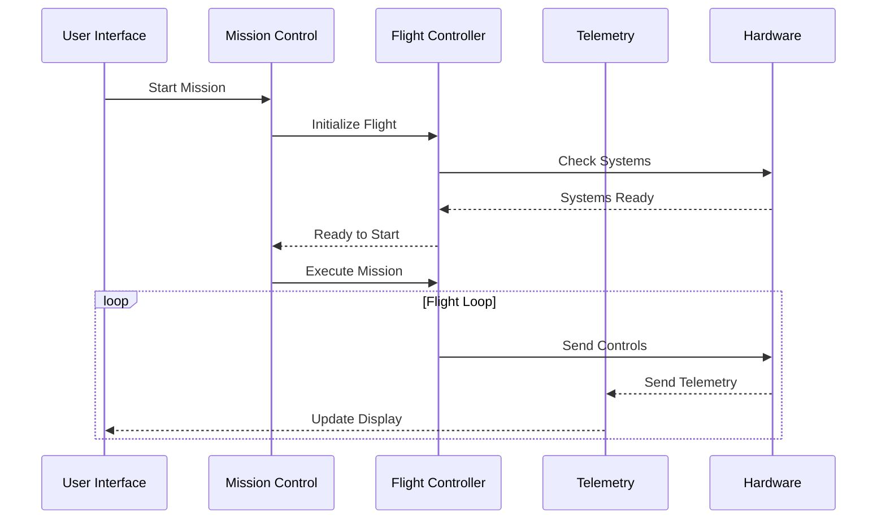

# Drone Control System Architecture

## 1. System Overview

### High-Level Architecture


### Data Flow Diagram (Level 0)


### Component Interaction Diagram


## 2. Directory Structure and Module Details

### Core System
```
src/
├── core/
│   ├── flight-control/
│   │   ├── FlightController.ts
│   │   ├── MotorController.ts
│   │   ├── AttitudeController.ts
│   │   ├── PositionController.ts
│   │   ├── StateEstimator.ts
│   │   └── SafetySystem.ts
│   ├── mission/
│   │   ├── MissionController.ts
│   │   ├── PathPlanner.ts
│   │   ├── NavigationSystem.ts
│   │   └── WaypointManager.ts
│   ├── sensors/
│   │   ├── SensorManager.ts
│   │   ├── SensorFusion.ts
│   │   └── CalibrationSystem.ts
│   └── communication/
│       ├── DataLink.ts
│       ├── CommandProcessor.ts
│       ├── TelemetryStream.ts
│       └── ProtocolHandler.ts
```

## 3. Detailed Module Specifications

### A. Flight Control System
```typescript
// Types and Interfaces
interface FlightState {
    position: Position;
    attitude: Attitude;
    velocity: Velocity;
    acceleration: Acceleration;
    timestamp: number;
}

interface ControlCommand {
    thrust: number;
    torque: Vector3D;
    timestamp: number;
}

// Main Classes
class FlightController {
    private stateEstimator: StateEstimator;
    private attitudeController: AttitudeController;
    private positionController: PositionController;
    private safetySystem: SafetySystem;

    public async initialize(): Promise<void>;
    public async startFlight(): Promise<void>;
    public async updateControlLoop(): Promise<void>;
    public async emergencyProcedure(): Promise<void>;
}
```

### B. Mission Control System
```typescript
// Types and Interfaces
interface Mission {
    id: string;
    waypoints: Waypoint[];
    parameters: MissionParameters;
    status: MissionStatus;
}

interface Waypoint {
    id: string;
    position: Position;
    actions: WaypointAction[];
}

// Main Classes
class MissionController {
    private pathPlanner: PathPlanner;
    private navigationSystem: NavigationSystem;
    private waypointManager: WaypointManager;

    public async planMission(waypoints: Waypoint[]): Promise<Mission>;
    public async executeMission(mission: Mission): Promise<void>;
    public async updateMissionStatus(): Promise<MissionStatus>;
}
```

### C. Communication System
```typescript
// Types and Interfaces
interface TelemetryPacket {
    timestamp: number;
    flightState: FlightState;
    systemStatus: SystemStatus;
    sensorData: SensorData;
}

interface CommandPacket {
    id: string;
    type: CommandType;
    parameters: unknown;
    priority: number;
}

// Main Classes
class DataLink {
    private protocolHandler: ProtocolHandler;
    private connectionManager: ConnectionManager;

    public async connect(): Promise<void>;
    public async sendCommand(command: CommandPacket): Promise<void>;
    public async receiveTelemetry(): Promise<TelemetryPacket>;
}
```
